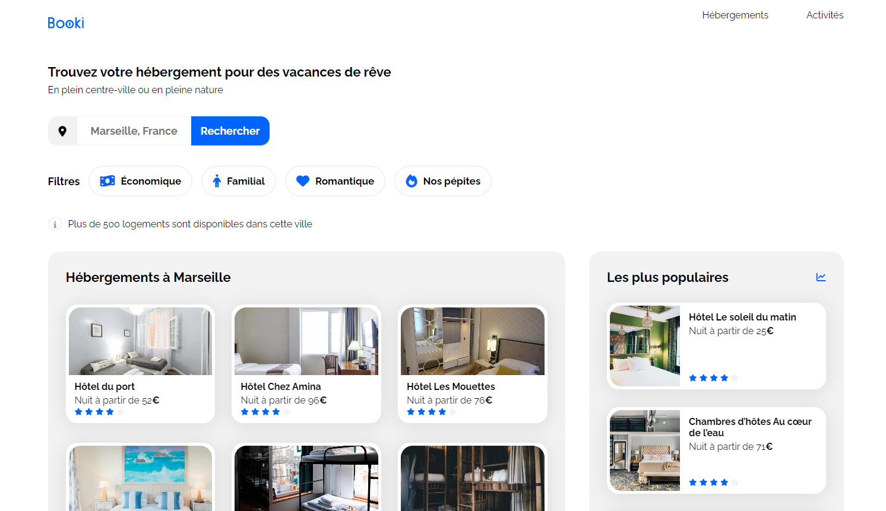

Site BOOKI

Ce dépôt correspond au projet 2 de la formation Développeur Web d'OpenClassroom. 

Il consiste en la création d'une page d'accueil d'une agence de voyages.

Avec ce projet, les objectifs étaient :
- d'implémenter une interface responsive avec HTML et CSS
- Intégrer du contenu conformément à une maquette avec HTML et CSS

La technologie utilisée pour ce projet :
- HTML 5
- CSS 3
- Git et Github pour le versionning

J'ai validé ce projet le 14 mai 2024.

Les points forts de mes livrables :
- le site est responsive (desktop, tablet, mobile)
- la sémantique est respectée (header, nav, footer, main,...)
- le code CSS et HTML sont validés par le W3C

Mes difficultés pour ce projet :
- faire le responsive design avec les différentes cards a été très compliqué au départ. Il m'a fallu le temps du projet pour trouver la bonne méthode à suivre. J’ai donc tout refait depuis le début, quelques jours avant la soutenance, pour être sûr d'avoir un code de qualité et un responsive design plus facile à réaliser.
- le versionning avec Git et GitHub. Connaître les commandes de terminal. Manipuler Git (et essayer de rattraper ces erreurs de commit !). Il m’a fallu pratiquer ces outils sur plusieurs projets avant d'être plus à l'aise.
